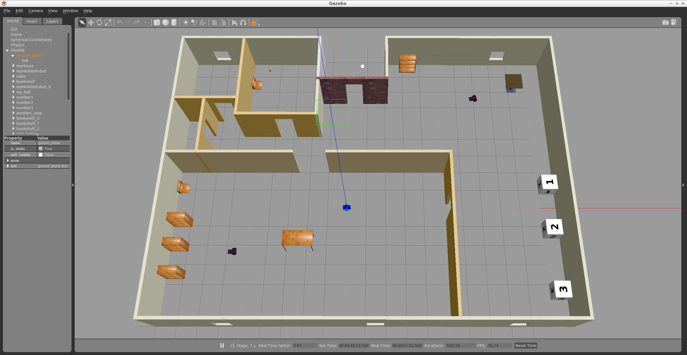
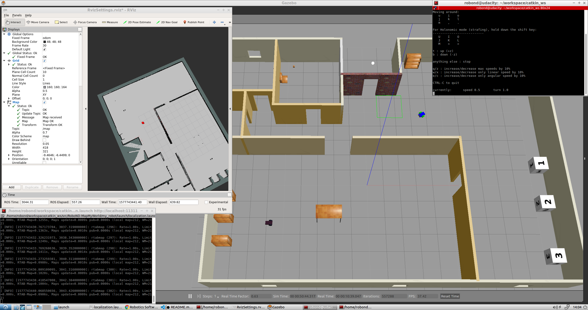

# RoboND-MapMyWorld
This is the repository for my Udacity Robotics Software Engineer Nanodegree Project - Map My World. In this project I created a 2D occupancy grid and 3D octomap from my simulated environment with my own robot with the RTAB-Map package.
It contains a simulation world with Gazebo which includes a robot equipped with a RGB-D camera and lidar sensor. The robot generates a map of it's surroundings with the ROS package RTAB-Map. The robot is also abl to localize itself with his own created map.

### Output
After launching the world the Building, MobileRobots, and the Robot (with camera and lidar) are displayed inside a Gazebo World. It should launch as follow:


After launching steps 4 and 5 you can choose to generate a map-database (step 6a) or to perform localization with a generated map-database (step 6b). If you launch step 6b and drive the robot around, it could look like that:


### Directory Structure
```
    .RoboND-MapMyWorld                            # main folder 
    ├── ball_chaser                             # ball_chaser package
    │   ├── launch                              # launch folder for launch files
    │   │   ├── ball_chaser.launch
    │   ├── src                                 # source folder for C++ scripts
    │   │   ├── drive_bot.cpp
    │   │   ├── process_images.cpp
    │   ├── srv                                 # service folder for ROS services
    │   │   ├── DriveToTarget.srv
    │   ├── CMakeLists.txt                      # compiler instructions
    │   ├── package.xml                         # package info
    ├── images                                  # output images
    │   ├── localization.png
    │   ├── output.png
    ├── my_robot                                # my_robot package
    │   ├── config                              # config files for the move base node
    │   │   ├── base_local_planner_params.yaml
    │   │   ├── costmap_common_params.yaml
    │   │   ├── global_costmap_params.yaml
    │   │   ├── local_costmap_params.yaml
    │   ├── launch                              # launch folder for launch files
    │   │   ├── amcl.launch
    │   │   ├── localization.launch
    │   │   ├── mapping.launch
    │   │   ├── robot_description.launch
    │   │   ├── RvizSettings.rviz
    │   │   ├── world.launch
    │   ├── maps                                # maps folder for maps
    │   │   ├── nancys_map.gpm                  # contains a map file for the world
    │   │   ├── nancys_map.yaml                 # contains parameters for nancys_map.gpm
    │   │   ├── rtabmap.db                      # contains the mapping database
    │   ├── meshes                              # meshes folder for sensors
    │   │   ├── hokuyo.dae
    │   ├── urdf                                # urdf folder for xacro files
    │   │   ├── my_robot.gazebo
    │   │   ├── my_robot.xacro
    │   ├── worlds                              # world folder for world files
    │   │   ├── nancys_world.world
    │   ├── CMakeLists.txt                      # compiler instructions
    │   ├── package.xml                         # package info
    ├── teleop_twist_keyboard                   # submodule Teleop
    │       ├── ...
    ├── .gitmodules                             # contains information about submodules
    └── README.md
```

### Steps to launch the simulation

#### 1 Clone the repository in the catkin workspace i.e. /home/workspace/catkin_ws/src
```sh
$ cd /home/workspace/catkin_ws/src
$ git clone https://github.com/nancyreschka/RoboND-MapMyWorld.git
```

#### 2 Initialize submodules
```sh
$ cd RoboND-WhereAmI
$ git submodule init
$ git submodule update
```

#### 3 Compile the code
```sh
$ cd /home/workspace/catkin_ws/
$ catkin_make
```

#### 4 Launch the robot inside the Gazebo world and RViz
```sh
$ cd /home/workspace/catkin_ws/
$ source devel/setup.bash
$ roslaunch my_robot world.launch
```

#### 5 Launch Teleop Node
The robot can be controlled with the help of the teleop package. Thanks to the ROS community, I could use ros-teleop package to send commands to my robot using keyboard or controller.
In a new terminal launch the ros-teleop node:
```sh
$ cd /home/workspace/catkin_ws/
$ source devel/setup.bash
$ rosrun teleop_twist_keyboard teleop_twist_keyboard.py
```
More information can be found at https://github.com/ros-teleop/teleop_twist_keyboard

#### 6a Launch the RTAB-Map Mapping Node
This step is used to genreate a new map with RTAB-Map.
In a new terminal:
```sh
$ cd /home/workspace/catkin_ws/
$ source devel/setup.bash
$ roslaunch my_robot mapping.launch
```

#### 6b Launch the RTAB-Map Localization Node
This step is used to to perform localization using the created map database.
In a new terminal:
```sh
$ cd /home/workspace/catkin_ws/
$ source devel/setup.bash
$ roslaunch my_robot localization.launch
```

#### 7 Load the configuration file in RViz
Open the configuration file RvizSettings.rviz in RViz. It is located in:
```sh
/home/workspace/catkin_ws/my_robot/launch
```

### The components

#### RTAB-Map

RTAB-Map (Real-Time Appearance-Based Mapping) is a popular solution for SLAM to develop robots that can map environments in 3D. RTAB-Map has good speed and memory management, and it provides custom developed tools for information analysis. Most importantly, the quality of the documentation on ROS Wiki (http://wiki.ros.org/rtabmap_ros) is very high. Being able to leverage RTAB-Map with your own robots will lead to a solid foundation for mapping and localization.

For this project the rtabmap_ros package was used, which is a ROS wrapper (API) for interacting with RTAB-Map.

After launching all three steps, navigate the robot in the simulation to create a map for the environment! When you are all set, exit the mapping node and you could find your map db file in the place you specified in the launch file (should be at /home/robond/workspace/, if you did not modify the argument, it will be located in the /root/.ros/ folder).

When you are done mapping, be sure to copy or move your database before moving on to map a new environment. Remember, relaunching the mapping node deletes any database in place on launch start up!

##### mapping.launch file

###### RTAB-Map

The mapping launch file acts as the main node that interfaces with all the required parts to be able to perform SLAM (Simultaneous localization and mapping) with RTAB-Map.

More documentation for RTAB-Map with ROS is available at http://wiki.ros.org/rtabmap_ros.

###### RTAB-Map Real Time Visualization

Another tool that you can use is rtabmapviz, which is an additional node for real time visualization of feature mapping, loop closures, and more. It’s not recommended to use this tool while mapping in simulation due to the computing overhead. rtabmapviz is great to deploy on a real robot during live mapping to ensure that you are getting the necessary features to complete loop closures.

The node can be activated in the mapping.launch file. Just uncomment it and then launch mapping.launch. The node launches the rtabmapviz GUI and provides you with realtime feature detection, loop closures, and other relevant information to the mapping process.

##### localization.launch file

The mapping launch file acts as the main node that interfaces with all the required parts to be able to perform SLAM (Simultaneous localization and mapping) with RTAB-Map while using a previous generated map database.

The database-file rtabmap.db is located in my_robot/maps/. It can be viewed and analysed with the help of rtabmap-databaseViewer, see section "Visualizing the mapping database".

#### AMCL

Adaptive Monte Carlo Localization (AMCL) dynamically adjusts the number of particles over a period of time, as the robot navigates around in a map. This adaptive process offers a significant computational advantage over MCL.

The ROS AMCL package (http://wiki.ros.org/amcl) implements this variant.

##### amcl.launch file

###### Map Server
The first node is the map_server node (http://wiki.ros.org/map_server). The map_server node provides map data as a ROS service to other nodes such as the amcl node. Here, map_server node will locate the map in the Map Setup step and send it out as the map data.

###### AMCL Node

The second node in the launch file is the amcl node. It takes odometry and laser scan data to perform the AMCL localization.

###### Move Base Node

With the move_base package you can define a navigation goal position for your robot in the map, and the robot will navigate to that goal position. Note that this step is optional if you choose to use teleop node to control and localize your robot.

The move_base package is a very powerful tool. It utilizes a costmap - where each part of the map is divided into which area is occupied, like walls or obstacles, and which area is unoccupied. As the robot moves around, a local costmap, in relation to the global costmap, keeps getting updated allowing the package to define a continuous path for the robot to move along.

What makes this package more remarkable is that it has some built-in corrective behaviors or maneuvers. Based on specific conditions, like detecting a particular obstacle or if the robot is stuck, it will navigate the robot around the obstacle or rotate the robot till it finds a clear path ahead.

#### OPTIONAL: Visualizing the mapping database
# 

The generated databvase of the map can be visualized with the help of rtabmap-databaseViewer.

It's a great tool for exploring your database when you are done generating it. It is isolated from ROS and allows for complete analysis of your mapping session.

This is how you will check for loop closures, generate 3D maps for viewing, extract images, check feature mapping rich zones, and much more!

```sh
rtabmap-databaseViewer /home/workspace/catkin_ws/my_robot/maps/rtabmap.db
```

Once open, add some windows to get a better view of the relevant information:

- Say yes to using the database parameters
- View -> Constraint View
- View -> Graph View

What you are seeing in the above image: On the left, you have your 2D grid map in all of its updated iterations and the path of your robot. In the middle you have different images from the mapping process. Here you can scrub through images to see all of the features from your detection algorithm. These features are in yellow. Then, what is the pink, you may ask? The pink indicates where two images have features in common and this information is being used to create neighboring links and loop closures! Finally, on the right you can see the constraint view. This is where you can identify where and how the neighboring links and loop closures were created.

You can see the number of loop closures in the bottom left. The codes stand for the following: Neighbor, Neighbor Merged, Global Loop closure, Local loop closure by space, Local loop closure by time, User loop closure, and Prior link.

When it comes time to design your own environment, this tool can be a good resource for checking if the environment is feature-rich enough to make global loop closures. A good environment has many features that can be associated in order to achieve loop closures.