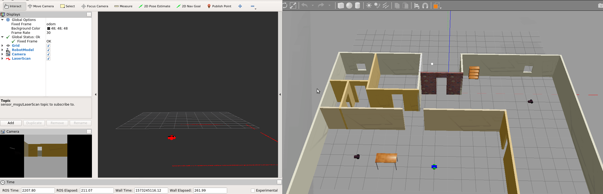

# RoboND-GoChaseIt
This is the code for my Udacity Robotics Software Engineer Nanodegree  - Go Chase It. It creates a simulation world with Gazebo which includes a robot equipped with a camera and lidar sensor that can chase a white ball.

### Output
After launching the world the Building, MobileRobots, the Robot (with camera and lidar), and a white ball are displayed inside a Gazebo World. It should launch as follow:


### Directory Structure
```
    .RoboND-GoChaseIt                  # main folder 
    ├── images                         # Code output image
    │   ├── output.png
    ├── my_robot                       # my_robot package
    │   ├── launch                     # launch folder for launch files
    │   │   ├── robot_description.launch
    │   │   ├── world.launch
    │   ├── meshes                     # meshes folder for sensors
    │   │   ├── hokuyo.dae
    │   ├── urdf                       # urdf folder for xacro files
    │   │   ├── my_robot.gazebo
    │   │   ├── my_robot.xacro
    │   ├── world                      # world folder for world files
    │   │   ├── nancys_world.world
    │   ├── CMakeLists.txt             # compiler instructions
    │   ├── package.xml                # package info
    ├── ball_chaser                    # ball_chaser package
    │   ├── include                    # include folder for include files
    │   ├── launch                     # launch folder for launch files
    │   │   ├── ball_chaser.launch
    │   ├── src                        # source folder for C++ scripts
    │   │   ├── drive_bot.cpp
    │   │   ├── process_images.cpp
    │   ├── srv                        # service folder for ROS services
    │   │   ├── DriveToTarget.srv
    │   ├── CMakeLists.txt             # compiler instructions
    │   ├── package.xml                # package info
    └── README.md
```

### Steps to launch the simulation

#### Clone the project folder i.e. in workspace /home/workspace/
```sh
$ cd /home/workspace/
$ git clone https://github.com/nancyreschka/RoboND-GoChaseIt.git
```

#### Copy the my_robot and ball_chaser folders into the source directory of Catkin workspace /home/workspace/catkin_ws/src

```sh
$ cd /home/workspace/catkin_ws/src
```

#### Compile the code
```sh
$ cd /home/workspace/catkin_ws/
$ catkin_make
```

#### Launch the robot inside the world 
```sh
$ cd /home/workspace/catkin_ws/
$ source devel/setup.bash
$ roslaunch my_robot world.launch
```

#### Run the ROS nodes drive_bot and process_image
In a new terminal:
```sh
$ cd /home/workspace/catkin_ws/
$ source devel/setup.bash
$ roslaunch ball_chaser ball_chaser.launch
```

#### Visualize the robot's camera image in RViz
Setup RViz to visualize the sensor readings. On the left side of RViz, under Displays:

* Select odom for fixed frame
* Click the Add button and
  * add RobotModel and your robot model should load up in RViz.
  * add Camera and select the Image topic "rgb/image_raw" that was defined in the camera Gazebo plugin
  * add LaserScan and select the topic "/scan" - that was defined in the Hokuyo Gazebo plugin