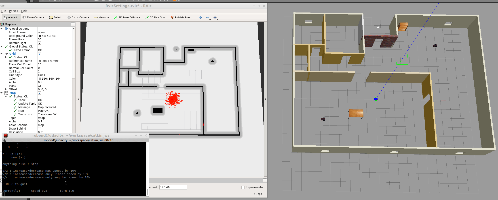

# RoboND-MapMyWorld -  TBD
This is the repository for my Udacity Robotics Software Engineer Nanodegree Project - Where Am I. It creates a simulation world with Gazebo which includes a robot equipped with a camera and lidar sensor. The robot localizes itself with the Monte Carlo Localization.

### Output
After launching the world the Building, MobileRobots, and the Robot (with camera and lidar) are displayed inside a Gazebo World. It should launch as follow:


### Directory Structure
```
    .RoboND-WhereAmI                            # main folder 
    ├── ball_chaser                             # ball_chaser package
    │   ├── launch                              # launch folder for launch files
    │   │   ├── ball_chaser.launch
    │   ├── src                                 # source folder for C++ scripts
    │   │   ├── drive_bot.cpp
    │   │   ├── process_images.cpp
    │   ├── srv                                 # service folder for ROS services
    │   │   ├── DriveToTarget.srv
    │   ├── CMakeLists.txt                      # compiler instructions
    │   ├── package.xml                         # package info
    ├── images                                  # output images
    │   ├── localization.gif
    │   ├── output1.png
    │   ├── output2.png
    │   ├── rviz.png
    ├── my_robot                                # my_robot package
    │   ├── config                              # config files for the move base node
    │   │   ├── base_local_planner_params.yaml
    │   │   ├── costmap_common_params.yaml
    │   │   ├── global_costmap_params.yaml
    │   │   ├── local_costmap_params.yaml
    │   ├── launch                              # launch folder for launch files
    │   │   ├── amcl.launch
    │   │   ├── robot_description.launch
    │   │   ├── RvizSettings.rviz
    │   │   ├── world.launch
    │   ├── maps                                # maps folder for maps
    │   │   ├── nancys_map.gpm
    │   │   ├── nancys_map.yaml                 # contains parameters for the map
    │   ├── meshes                              # meshes folder for sensors
    │   │   ├── hokuyo.dae
    │   ├── urdf                                # urdf folder for xacro files
    │   │   ├── my_robot.gazebo
    │   │   ├── my_robot.xacro
    │   ├── worlds                              # world folder for world files
    │   │   ├── nancys_world.world
    │   ├── CMakeLists.txt                      # compiler instructions
    │   ├── package.xml                         # package info
    ├── teleop_twist_keyboard                   # submodule Teleop
    │       ├── ...
    ├── .gitmodules                             # contains information about submodules
    └── README.md
```

### Steps to launch the simulation

#### Clone the repository in the catkin workspace i.e. /home/workspace/catkin_ws/src
```sh
$ cd /home/workspace/catkin_ws/src
$ git clone https://github.com/nancyreschka/RoboND-WhereAmI.git
```

#### Initialize submodules
```sh
$ cd RoboND-WhereAmI
$ git submodule init
$ git submodule update
```

#### Compile the code
```sh
$ cd /home/workspace/catkin_ws/
$ catkin_make
```

#### Launch the robot inside the world and RViz
```sh
$ cd /home/workspace/catkin_ws/
$ source devel/setup.bash
$ roslaunch my_robot world.launch
```

#### Launch the Monte Carlo Localization
In a new terminal:
```sh
$ cd /home/workspace/catkin_ws/
$ source devel/setup.bash
$ roslaunch my_robot amcl.launch
```

#### Load the configuration file in RViz
Open the configuration file RvizSettings.rviz in RViz. It is located in:
```sh
/home/workspace/catkin_ws/my_robot/launch
```

#### OPTIONAL: Run Teleop Package
The robot can be controlled with the help of the teleop package. Thanks to the ROS community, I could use ros-teleop package to send commands to my robot using keyboard or controller.
In a new terminal launch the ros-teleop node:
```sh
$ cd /home/workspace/catkin_ws/src
$ source devel/setup.bash
$ rosrun teleop_twist_keyboard teleop_twist_keyboard.py
```
More information can be found at https://github.com/ros-teleop/teleop_twist_keyboard

### The components

#### AMCL

Adaptive Monte Carlo Localization (AMCL) dynamically adjusts the number of particles over a period of time, as the robot navigates around in a map. This adaptive process offers a significant computational advantage over MCL.

The ROS AMCL package (http://wiki.ros.org/amcl) implements this variant.

##### amcl.launch file

###### Map Server
The first node is the map_server node (http://wiki.ros.org/map_server). The map_server node provides map data as a ROS service to other nodes such as the amcl node. Here, map_server node will locate the map in the Map Setup step and send it out as the map data.

###### AMCL Node

The second node in the launch file is the amcl node. It takes odometry and laser scan data to perform the AMCL localization.

###### Move Base Node

With the move_base package you can define a navigation goal position for your robot in the map, and the robot will navigate to that goal position. Note that this step is optional if you choose to use teleop node to control and localize your robot.

The move_base package is a very powerful tool. It utilizes a costmap - where each part of the map is divided into which area is occupied, like walls or obstacles, and which area is unoccupied. As the robot moves around, a local costmap, in relation to the global costmap, keeps getting updated allowing the package to define a continuous path for the robot to move along.

What makes this package more remarkable is that it has some built-in corrective behaviors or maneuvers. Based on specific conditions, like detecting a particular obstacle or if the robot is stuck, it will navigate the robot around the obstacle or rotate the robot till it finds a clear path ahead.
